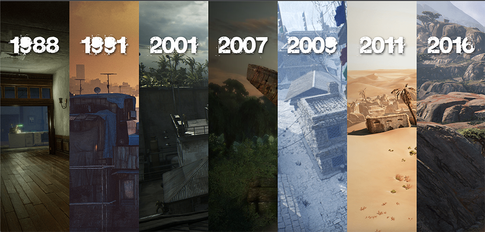
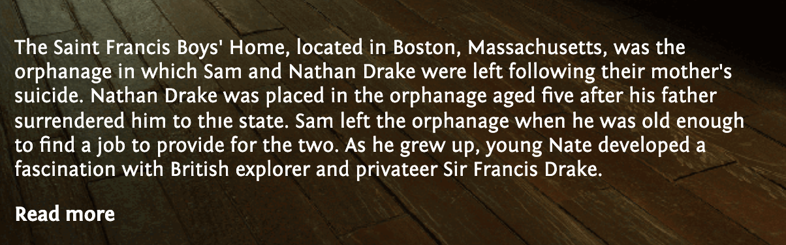
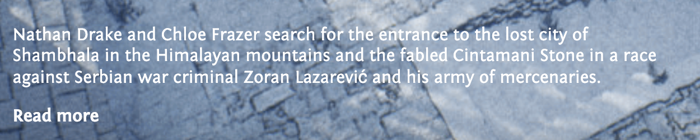
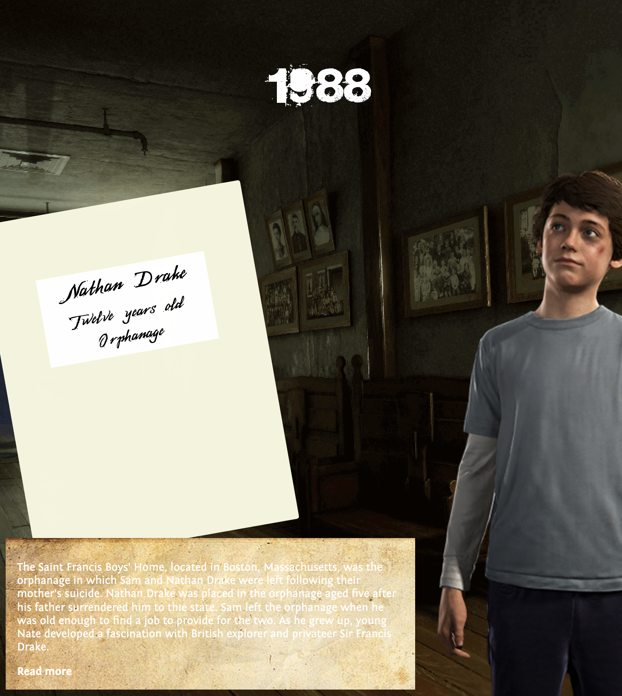

# Procesverslag

## Jij

### Ontwerper:

Micky Puck van Dartel

#### Je startniveau:

Mijn startniveau is: blauw, volgens Sanne rood.

# Je plan

  
De eerste versie/schets van je ontwerp & je persoonlijke uitdaging

### De eerste versie/schets:

  

### Je ambitie:

  Aan deze technieken/punten wil ik werken:

-   Grid/Flex
-   Semantisch correctheid
-   Nette code
-   Custom properties

## Voortgang/Feedback 1

  
Mijn bevindingen + wijzigingen

### Bevinding 1:

  
  Jeremy leek het handig om ook de game te vermelden waar de Nathan Drake in voor komt en het jaartal.

#### oplossing:

  Ik heb dit nog niet gecodeerd, maar ga ik zeker proberen.

#### update:

  Ik heb het jaartal en de welke game het is op de cover gezet van elk jaartal, zodat je het meteen duidelijk ziet.

### Bevinding 2:

  Een parallax effect zou heel cool zijn om hier voor te gebruiken. Ook door de timeline rechts op de pagina.

#### oplossing:

  Ik heb dit nog niet gecodeerd, maar ga ik zeker proberen. Een parallax was al mijn idee, maar Jeremy had ook aangegeven dat ik dan de timeline rechts ook mee zou kunnen bewegen.

#### update:

  Dit idee heb ik niet meer toegepast, omdat ik mijn idee had veranderd. We mogen maar 1 pagina gebruiken en dit idee had is samen bedacht met nog een andere pagina waarin het goed zou werken. Toen Sanne de horizontale 'tijdlijn' liet zien, kreeg ik opeens ideeën om daar iets mee toen en dat heb ik dus uiteindelijk gedaan.

### Bevinding 3:

  
  Omdat ik best weinig zou css'en en dat wel een doel is, zei Jeremy dat ik het kompas in css zou kunnen maken

#### oplossing:

  Ik heb dit nog niet gecodeerd, maar ga ik zeker proberen te doen!

#### update:

  Ik heb uiteindelijk geen kompas in mijn ontwerp gedaan. De wereldkaart viel weg en een kompas was überhaupt een extraatje.

### Bevinding 4:

  
  Sanne had aangegeven dat er maar 1 pagina mag zijn. Ik zou een popup kunnen gebruiken voor de 'tweede' pagina, maar dat leek mij niet heel handig, want ik wil dat de popup dan een soort pagina wordt en ik heb het idee dat dat veel te moeilijk zou worden.

#### oplossing:

  Deze pagina haal ik weg. Het wordt nu alleen de pagina die je ziet in mijn eerste schets. Die is ook meer advanced.

### Bevinding 5:

  Jeremy gaf aan dat ik misschien deze pagina in het klein zou kunnen weergeven op de andere pagina, sinds deze wegvalt. Zodat je weet waar de Nathan Drake zich bevind in de timeline.

#### oplossing:

  Ik heb dit nog niet gecodeerd, maar ga ik zeker proberen.

#### update:

  Ik heb de wereldkaart uiteindelijk uit mijn ontwerp gelaten, omdat het dan veel te vol werd op de website. Ook vond ik het niet meer veel toevoegen voor de tijdlijn, omdat hij veel reist.

## Voortgang/Feedback 2

  
Mijn bevindingen + wijzigingen

### Bevinding 1:

  
  De website is nog niet helemaal responsive. De jaartallen blijven erg groot en bij een erg klein scherm overlappen de onderdelen raar over elkaar. - Zara

#### oplossing:

  Ik ga de jaartallen waarschijnlijk met een media query responsive maken. En ik ga mij niet heel erg focussen op kleinere schermen. Ik maak de website een beetje responsive, ook door tijd tekort.

#### update:

  Ik heb de jaartallen nu iets kleiner gemaakt, waardoor het op kleinere schermen er iets beter uit ziet.

### Bevinding 2:

  
  
  Voor de teksten moet ik letten op het contrast. - Zara

#### oplossing:

  Ik heb het er ook met Sanne over gehad en ik ga nu een background toevoegen, voor beter contrast. Uncharted heeft 4 games met 4 verschillende menu stijlen. Ik ga die nu namaken en toevoegen aan de achtergrond van de tekst.

#### update:

  Door tijd tekort en omdat het best lelijk eruit ziet. Heel inconsistent. Heb ik nu een Uncharted 1 stijl achtergrond gekozen voor de tekst om het contrast beter te maken. Ook heb ik een drop shadow toegevoegd aan de tekst. Dit is heel gebruikelijk voor Uncharted.

### Bevinding 3:

  Nog meer commentaar in de code weergeven. - Zara

#### oplossing:

  Hier was ik nog niet aan toegekomen. Dit wilde ik zeker nog toepassen, niet alleen voor de voorwaarden maar ook voor mijzelf.

### Bevinding 4:

  Custom properties gebruiken. - Zara

#### oplossing:

  Hier was ik nog niet aan toegekomen. Omdat het een voorwaarde is, moet ik dit nog even doen!

### Bevinding 5:

  Ik zou ook nog de game vermelden welke Nathan Drake in welke game voorkomt. - Zara

#### oplossing:

  Ik heb het jaartal en de welke game het is op de cover gezet van elk jaartal, zodat je het meteen duidelijk ziet.

### Bevinding 6:

  Voor Sanne hoeft het niet perse, maar het is wel handig om nog voor een header te zorgen. Dit vind Google ook erg fijn.

#### oplossing:

  Omdat de tijdlijn fullscreen is, vind ik het erg lelijk om nog ergens een header toe te voegen. Ik heb dit opgelost om de header na een paar seconde te laten verdwijnen nadat je op de website komt, zodat je wel weet waar de website over gaat.

### Bevinding 7:

  
  
  De mapjes met de tekst die verschijnen zijn misschien een beetje te groot. - Zara

#### oplossing:

  Ik was al van plan het mapje wat kleiner te maken. De andere mapjes worden vervangen door andere voorwerpen.

## Voortgang/Feedback 3

  
Mijn bevindingen + wijzigingen

### Bevinding 1:

  Nog even letten op toetsenbordnavigatie. - Ellen

#### oplossing:

  Dit moet ik inderdaad nog doen!

### Bevinding 2:

  Ik vind de tekst van de header onder het logo nog niet pakkend genoeg. - Mirte

#### oplossing:

  Als ik tijd genoeg heb dan ga ik kijken of ik daar wat aan kan doen.

## Reflectie

  
Mijn eindresultaat & persoonlijke ontwikkeling

### Je uitkomst - karakteristiek screenshot(s):

  

### Dit ging goed/Heb ik geleerd:

  Ik weet nu hoe ik custom properties moet gebruiken. Dat vind ik wel heel handig. Ik keek er eerst tegenop, maar het was uiteindelijk heel weinig werk. Dit kwam ook omdat ik erg weinig kleur heb gebruikt.

  Ook weet ik hoe je tabindex moet gebruiken. Net zoals bij de custom properties was ik bang dat dit heel veel werk zou zijn, maar nee.

  

### Dit was lastig/Is niet gelukt:

  Wereldkaart met locatie. Mij leek het leuk om ook op een wereldkaart te laten zien waar Nathan Drake zich in die game/jaar zich allemaal bevond. Omdat de tijdlijn vrij krap werd en ik het idee van het uitklappen van de pagina niet kon toevoegen heb ik dit idee uiteindelijk laten zitten.

  Het uitklappen van de pagina na het klikken op iets in de pagina. Dus dat je meer informatie te zien krijgt over Nathan Drake etc. Ik kwam er al snel achter dat dit te hoog gegrepen was voor mij (te moeilijk en te weinig tijd), dus heb ik het gelaten bij ‘read me’ en dat te linken naar de wiki page. (Te moeilijk en te weinig tijd)

  Als je op de relic klikt wilde ik eigenlijk ook dat je het sound effect hoorde als je een relic oppakt in Uncharted. Door tijd te kort heb ik dat niet meer kunnen toevoegen.

  Ik vond het heel lastig om de content in elk vakje te krijgen en goed uit te lijnen. Ook omdat het zoveel content is wat ik erin moest proppen als het ware.

  (Ik heb hier niet echt afbeeldingen om te laten zien)

## Bronnenlijst

continu bijhouden terwijl je werkt

Afbeeldingen
1\. Favicon - <https://strategywiki.org/wiki/Uncharted:_Drake%27s_Fortune/Trophies> van ?
2\. 1988 background image - <https://www.artstation.com/artwork/gGdzm> van Rogelio Olguin
3\. 1991 background image - <https://www.artstation.com/artwork/nxb06> van Brian Recktenwald
4\. 2001 background image - <https://www.artstation.com/artwork/dGRbJ> van Simon Craghead
5\. 2007 background image - <https://www.artstation.com/artwork/xz34PY> van Christophe Desse
6\. 2009 background image - <https://www.artstation.com/artwork/5BXYXE> van Bibhab Raj Joshi
7\. 2011 background image - <https://www.artstation.com/artwork/lyGR5> van Adrian Castro
8\. 2016 background image - <https://www.artstation.com/artwork/uncharted-4-a-thief-s-end-madagascar> van Anthony Vaccaro
9\. 1988 Nathan Drake image - <https://www.artstation.com/artwork/eVBEY> van Frank Tzeng
10\. 1991 Nathan Drake image - <https://mygameslounge.com/reviews/uncharted-3-drakes-deception-hd-review/> van David Game
11\. 2001 Nathan Drake image - <https://unchartedsterritory.tumblr.com/post/152501435322/nathan-drake-in-uncharted-4-chapter-2-infernal> van thenerdychronicles
12\. 2007 Nathan Drake image - <https://pngset.com/download-free-png-pkrvl> van ?
13\. 2009 Nathan Drake image - <https://www.leatherjacketblack.com/product/nathan-drake-uncharted-2-jacket/> van ?
14\. 2011 Nathan Drake image - <https://www.pngwing.com/en/free-png-bxbvt> van ?
15\. 2016 Nathan Drake image - <http://toolsandtoys.net/reviews/a-review-of-uncharted-4-a-thiefs-end/> van Alvaro Serrano
16\. Uncharted 1 logo - <https://logodix.com/logos/1610547> van ?
17\. Uncharted 2 logo - <https://www.pngplay.com/nl/image/259130> van Arsh
18\. Uncharted 3 logo - <https://www.deviantart.com/jaz350z/art/Uncharted-3-Logo-Render-189072115> van jaz350z
19\. Uncharted 4 logo - <https://www.pngplay.com/nl/image/166871> van Arsh
20\. Uncharted logo header - <https://uncharted.fandom.com/wiki/Uncharted_series> van ?
21\. Relic 1 (ring) - <https://www.pricepulse.app/sir-francis-drake-ring-necklace-from-uncharted-3-c_us_12052217> van ?
22\. Relic 2 (dagger) - <https://www.artstation.com/artwork/wGrnO> van Josh Pears
23\. Relic 3 (coin) - <https://www.artstation.com/artwork/QLlyB> van Bradford Smith
24\. Relic 4 (compass) - <https://www.artstation.com/artwork/0XKkLY> van Khairizal Anwar
25\. Wrinkled paper - <https://flyclipart.com/paper-wrinkled-lines-to-write-signs-note-paper-rug-paper-towel-towel-hd-png-download-1118377> van ?
26\. Mugshot Nathan Drake - <https://segmentnext.com/uncharted-4-nathan-drake-model-shows-off-new-character-detail/> van Paul Metcalf
27\. ID image - <https://www.insider.com/what-drivers-license-looks-like-in-every-state#alabamas-drivers-license-shows-the-states-capitol-building-which-is-located-in-montgomery-1> van Gabbi Shaw and Frank Olito
28\. ID Nathan Drake - <https://www.thegamer.com/20-times-nathan-drake-was-definitely-one-of-us/> van TG STAFF
29\. Postcard - <https://hdclipartall.com/vintage-clip-art-darling-snowman-postcard-finland-postcard-clipart-1600_1061-081612.html> van ?
30\. Wedding picture - <https://twitter.com/bestofvidgames/status/1333083319374901251?lang=zh-Hant> van bestofvidgames
31\. Card holder mockup - <https://www.divineworks.biz/free-card-holder-mockup/> van divineworks
32\. Coffee stain - <https://cosplayandcoffee.com/cropped-coffee-stain-png/> van Cosplay and Coffee
33\. Paperclip - <https://www.clipartmax.com/middle/m2i8N4i8H7i8H7m2_paperclip-png-download-paper-clip-png-transparent/> van ?
34\. Old paper texture - <https://wallpaperaccess.com/old-paper> - van ?

Code
1\. Horizontale tijdlijn flex - <https://codepen.io/shooft/pen/XWZKdgM> van Sanne naar een idee van Jen Simmons
2\. Hover underline animation - <https://www.30secondsofcode.org/css/s/hover-underline-animation> van Trinityyi
3\.

