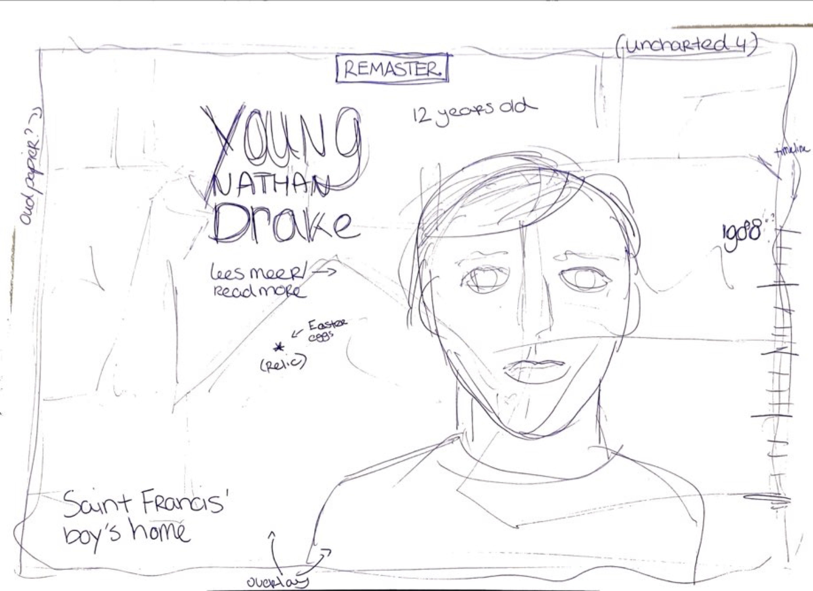
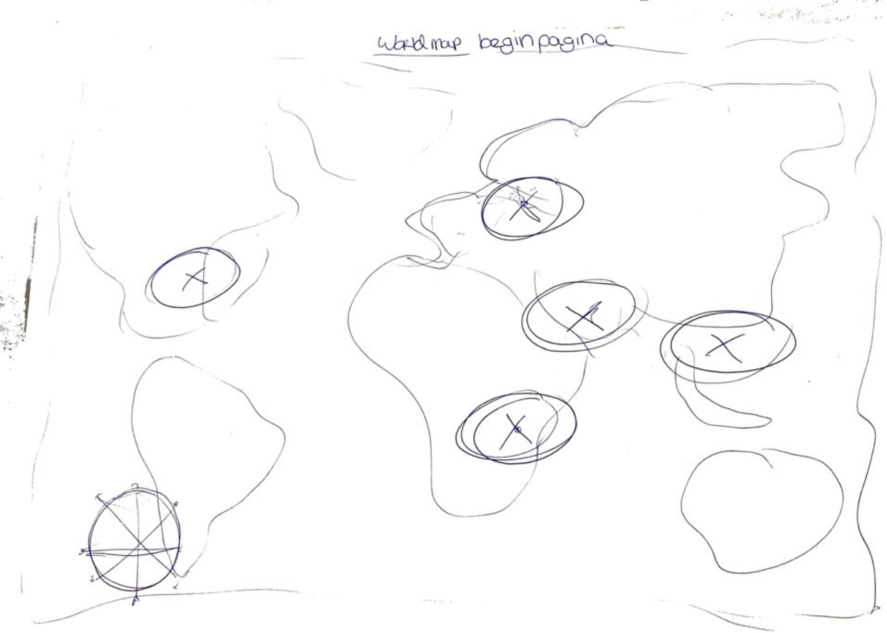

# Procesverslag
Markdown is een simpele manier om HTML te schrijven.  
Markdown cheat cheet: [Hulp bij het schrijven van Markdown](https://github.com/adam-p/markdown-here/wiki/Markdown-Cheatsheet).

Nb. De standaardstructuur en de spartaanse opmaak van de README.md zijn helemaal prima. Het gaat om de inhoud van je procesverslag. Besteedt de tijd voor pracht en praal aan je website.

Nb. Door *open* toe te voegen aan een *details* element kun je deze standaard open zetten. Fijn om dat steeds voor de relevante stuk(ken) te doen.

## Jij

### Ontwerper:
Micky Puck van Dartel

#### Je startniveau:
Mijn startniveau is: blauw

# Je plan

  
De eerste versie/schets van je ontwerp & je persoonlijke uitdaging

  ### De eerste versie/schets:
  

  ### Je ambitie:
  Aan deze technieken/punten wil ik werken:
  - Parallax scrolling
  - Grid/Flex
  - Semantisch correctheid

## Voortgang/Feedback 1

  
Mijn bevindingen + wijzigingen

  ### Bevinding 1:
  
  Jeremy leek het handig om ook de game te vermelden waar de Nathan Drake in voor komt en het jaartal.

  #### oplossing:
  Ik heb dit nog niet gecodeerd, maar ga ik zeker vermelden.

  ### Bevinding 2:
  Een parallax effect zou heel cool zijn om hier voor te gebruiken. Ook door de timeline rechts op de pagina.

  #### oplossing:
  Ik heb dit nog niet gecodeerd, maar ga ik zeker vermelden. Een parallax was al mijn idee, maar Jeremy had ook aangegeven dat ik dan de timeline rechts ook mee zou kunnen bewegen.

  ### Bevinding 3:
  
  Omdat ik best weinig zou css'en en dat wel een doel is, zei Jeremy dat ik het kompas in css zou kunnen maken

  #### oplossing:
  Ik heb dit nog niet gecodeerd, maar ga ik zeker proberen te doen!

  ### Bevinding 4:
  
  Sanne had aangegeven dat er maar 1 pagina mag zijn. Ik zou een popup kunnen gebruiken voor de 'tweede' pagina, maar dat leek mij niet heel handig, want ik wil dat de popup dan een soort pagina wordt en ik heb het idee dat dat veel te moeilijk zou worden.

  #### oplossing:
  Deze pagina haal ik weg. Het wordt nu alleen de pagina die je ziet in mijn eerste schets. Die is ook meer advanced.

  ### Bevinding 5:
  Jeremy gaf aan dat ik misschien deze pagina in het klein zou kunnen weergeven op de andere pagina, sinds deze wegvalt. Zodat je weet waar de Nathan Drake zich bevind in de timeline.

  #### oplossing:
  Ik heb dit nog niet gecodeerd, maar ga ik zeker vermelden.

## Voortgang/Feedback 2

  
Mijn bevindingen + wijzigingen (minimaal 5)

  ### Bevinding 1:
  Omschrijving van wat er nog niet orde was (tekst en afbeeding(en)).

  #### oplossing:
  Beschrijving hoe je het hebt hebt opgelost of als het niet gelukt is hoe je het zou oplossen (tekst en afbeeding(en)).

  ### Bevinding 2:
  Omschrijving van wat er nog niet orde was (tekst en afbeeding(en)).

  #### oplossing:
  Beschrijving hoe je het hebt hebt opgelost of als het niet gelukt is hoe je het zou oplossen (tekst en afbeeding(en)).

  ### Bevinding 3:
  ...

## Voortgang/Feedback 3

  
Mijn bevindingen + wijzigingen (minimaal 5)

  ### Bevinding 1:
  Omschrijving van wat er nog niet orde was (tekst en afbeeding(en)).

  #### oplossing:
  Beschrijving hoe je het hebt hebt opgelost of als het niet gelukt is hoe je het zou oplossen (tekst en afbeeding(en)).

  ### Bevinding 2:
  Omschrijving van wat er nog niet orde was (tekst en afbeeding(en)).

  #### oplossing:
  Beschrijving hoe je het hebt hebt opgelost of als het niet gelukt is hoe je het zou oplossen (tekst en afbeeding(en)).

  ### Bevinding 3:
  ...

## Reflectie

  
Mijn eindresultaat & persoonlijke ontwikkeling

  ### Je uitkomst - karakteristiek screenshot(s):
  

  ### Dit ging goed/Heb ik geleerd:
  Korte omschrijving met plaatje(s)

  

  ### Dit was lastig/Is niet gelukt:
  Korte omschrijving met plaatje(s)

  

## Bronnenlijst

continu bijhouden terwijl je werkt

Nb. Wees specifiek ('css-tricks' als bron is bijv. niet specifiek genoeg).

1. Favicon - https://strategywiki.org/wiki/Uncharted:_Drake%27s_Fortune/Trophies
2. bron 2
3. ...

